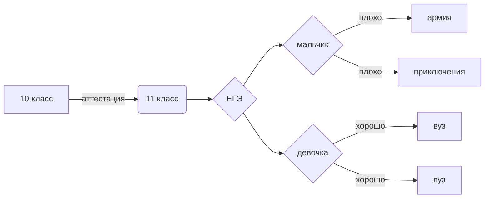

Демьянчук Андрей
122 группа (10б)

### ПРОГРАММЫ НА ПАЙТОНЕ 

папка "черепаха" - задания с черепахой на пайтоне

"Task1.py", "Task2.py", "Task3.py" - работа с системами  счисления и таблицей умножения в разных системах на пайтоне

"bd.py" - база данных на пайтоне с выбором запроса 

"first.py" - программа по нахождению информационного оъема в сообщении на пайтоне 

"егэ.py" - задание из ЕГЭ на пайтоне 

### ТАБЛИЦЫ В EXEL

"Логика.xlsx" -  табица алгебры логики

"биты, байты, вероятность.xlsx" - таблица с 4 листами. 1 -  рассчет вероятности. 2 - расчет в битах или байтах в предложении. 3, 4 - переводы из различных систем счисления. 

"таблица умножения.xlsx" - 2 листа. 1 - таблица умножения 20 на 20. 2 - степени двойки от 1 до 20.

"морза.xlsx" - табица по переводу слова в азбуку Морза

### ДРУГОЕ

"Программа перевода по коду Хэмминга" - программа для переводы кода Хеминга 

"нейронка" - скрин работы нейронной сети

"sql" - команды sql

"wordpress" - ссылка на свой сайт

https://clck.ru/32A36C - ссылка на open processing

### Команды для бд
SHOW TABLES показывает название колличество таблиц

SELECT = FROM users  выводим пользователей дб

SELECT = FROM grades выводим оценки 

SELECT = FROM users, grades WHERE users-users_id - grades-users_id   у кого какие оценки

SELECT = FROM users WHERE fam > "Демьянчук"  ищем себя 

### Закон поглащения (13)
$$ A \vee (A \wedge B)=A $$

